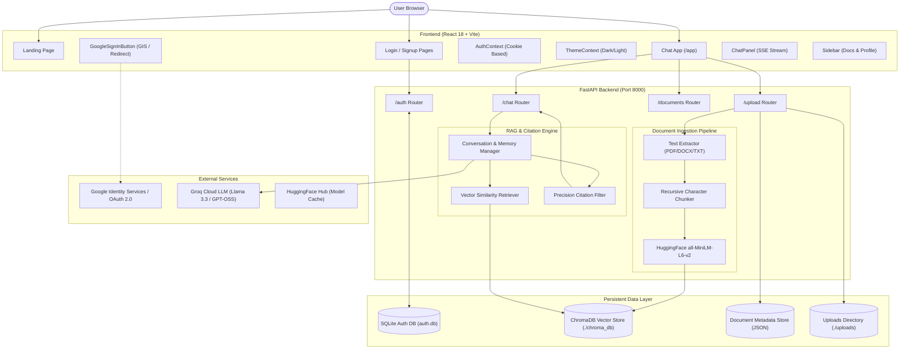

# DocChat AI — Complete System Documentation & Architecture Reference

> **Version:** 1.2.0  
> **Last Updated:** September 2026  
> **Repository:** `suyashmudgal/RAG`  
> **Status:** Production-Ready / Fully Integrated

---

## Table of Contents

1. [Executive Overview](#1-executive-overview)
2. [System Architecture](#2-system-architecture)
   - [High-Level Architectural Diagram](#high-level-architectural-diagram)
   - [End-to-End Data Flow](#end-to-end-data-flow)
3. [Technology Stack](#3-technology-stack)
4. [Authentication & Security Subsystem](#4-authentication--security-subsystem)
   - [User Management & SQLite Database](#user-management--sqlite-database)
   - [Password Security (Bcrypt)](#password-security-bcrypt)
   - [Session Management (JWT HTTP-Only Cookies)](#session-management-jwt-http-only-cookies)
   - [Google OAuth 2.0 & Identity Services (GIS)](#google-oauth-20--identity-services-gis)
5. [Document Ingestion & RAG Pipeline](#5-document-ingestion--rag-pipeline)
   - [File Ingestion & Multi-Format Extraction](#file-ingestion--multi-format-extraction)
   - [Page-Aware Text Extraction](#page-aware-text-extraction)
   - [Recursive Text Chunking](#recursive-text-chunking)
   - [Local Embeddings Generation](#local-embeddings-generation)
   - [ChromaDB Persistence & Metadata Store](#chromadb-persistence--metadata-store)
6. [Precision Retrieval & Citation Engine](#6-precision-retrieval--citation-engine)
   - [Negative Answer Detection](#negative-answer-detection)
   - [ChromaDB Distance-to-Similarity Conversion](#chromadb-distance-to-similarity-conversion)
   - [Answer-Source Lexical & Numeric Fact Alignment](#answer-source-lexical--numeric-fact-alignment)
   - [Relative Margin & Page-Level Deduplication](#relative-margin--page-level-deduplication)
7. [Inference, Chat & Streaming Engine](#7-inference-chat--streaming-engine)
   - [Groq LLM Integration](#groq-llm-integration)
   - [Grounding System Prompt](#grounding-system-prompt)
   - [Real-Time Server-Sent Events (SSE) Streaming](#real-time-server-sent-events-sse-streaming)
   - [Conversational Memory](#conversational-memory)
8. [Frontend Architecture & UI Design System](#8-frontend-architecture--ui-design-system)
   - [Design Tokens & Theme Engine (Dark / Light)](#design-tokens--theme-engine-dark--light)
   - [Page Structure & Routing](#page-structure--routing)
   - [Component Hierarchy](#component-hierarchy)
   - [Client-Side State Management](#client-side-state-management)
9. [Complete API Reference](#9-complete-api-reference)
   - [Authentication Endpoints](#authentication-endpoints)
   - [Document Management Endpoints](#document-management-endpoints)
   - [Chat & Ingestion Endpoints](#chat--ingestion-endpoints)
   - [System Endpoints](#system-endpoints)
10. [Configuration & Environment Variables](#10-configuration--environment-variables)
11. [Installation & Deployment Guide](#11-installation--deployment-guide)
   - [Backend Setup](#backend-setup)
   - [Frontend Setup](#frontend-setup)
   - [Google Cloud Console Setup Checklist](#google-cloud-console-setup-checklist)
12. [Testing & Quality Assurance](#12-testing--quality-assurance)
13. [Troubleshooting & FAQs](#13-troubleshooting--faqs)

---

## 1. Executive Overview

**DocChat AI** is an enterprise-grade, retrieval-augmented generation (RAG) platform designed to eliminate hallucinations by grounding Large Language Model (LLM) responses strictly in uploaded user documents.

### Key Value Propositions
- **Multi-Format Ingestion:** Seamlessly parse, extract, and index `.pdf`, `.docx`, and `.txt` files.
- **Strict Grounding with Page-Level Citations:** Every claim made by the assistant is backed by verifiable document citations, including source document name, exact page numbers, similarity scores, and excerpt snippets.
- **Fast, Free Local Embeddings:** Utilizes HuggingFace's `sentence-transformers/all-MiniLM-L6-v2` locally on the CPU—eliminating external embedding API costs and privacy concerns.
- **Ultra-Fast LLM Inference:** Powered by Groq's high-speed LPU inference engine (`openai/gpt-oss-120b` or `llama-3.3-70b-versatile`).
- **Dual Authentication Modes:** Native email/password authentication with encrypted bcrypt hashing alongside Google OAuth 2.0 (Google Identity Services One-Tap + automated redirect fallback).
- **Modern Responsive UI:** Polished glassmorphic interface with real-time SSE token streaming, Markdown syntax highlighting, dark/light theme toggle, and mobile responsiveness.

---

## 2. System Architecture

DocChat AI follows a decoupled client-server architecture:
- **Frontend:** Single Page Application (SPA) built with **React 18**, **Vite**, and **Vanilla CSS (Design Tokens)**.
- **Backend:** High-performance asynchronous API server built with **FastAPI**, **Uvicorn**, and **LangChain**.
- **Vector Database:** Persistent **ChromaDB** storage.
- **Relational Storage:** Serverless **SQLite** with async I/O via **aiosqlite**.

### High-Level Architectural Diagram



### End-to-End Data Flow

#### 1. Ingestion Flow
```
User uploads file 
  ──> POST /upload (multipart/form-data)
  ──> Validates file extension & file size (max 50 MB)
  ──> Saves to ./uploads/<doc_id>_<filename>
  ──> PyPDFLoader / Docx2txtLoader / TextLoader parses text with page metadata
  ──> RecursiveCharacterTextSplitter divides text (chunk_size=800, overlap=200)
  ──> HuggingFaceEmbeddings encodes chunks into 384-dimensional vectors
  ──> ChromaDB persists embeddings, text chunks, and metadata (filename, page, doc_id)
  ──> Document metadata registry records status, size, timestamp, and chunk count
  ──> Client receives 200 OK with chunk statistics
```

#### 2. Query & Generation Flow (Streaming)
```
User asks question 
  ──> POST /chat/stream
  ──> Query is embedded via all-MiniLM-L6-v2
  ──> ChromaDB retrieves top-K candidate chunks (k=6) with L2 distances
  ──> L2 distances converted to normalized similarity scores [0, 1]
  ──> Candidate chunks injected into context window alongside conversation history
  ──> Groq LLM streams response tokens in real-time via Server-Sent Events (SSE)
  ──> Once generation finishes:
        • Negative phrase detector checks if LLM stated data wasn't found
        • Answer-source lexical & numeric fact alignment filters ungrounded chunks
        • Relative margin filter removes low-confidence outliers
        • Page-level deduplicator combines multi-chunk matches from same page
  ──> Final SSE event emits JSON payload of validated SourceCitations
```

---

## 3. Technology Stack

| Layer | Component | Technology / Library | Role & Purpose |
| :--- | :--- | :--- | :--- |
| **Frontend UI** | Framework | React 18.3 | Reactive Single Page Application architecture |
| | Tooling | Vite 5.4 | Ultra-fast HMR and production bundle builder |
| | Routing | React Router DOM 6 | Client-side routing with route guards |
| | Styling | Vanilla CSS Variables | Theme-aware design system (Dark & Light modes) |
| | Markdown | React Markdown + Prism | Syntax-highlighted code rendering and tables |
| **Backend API** | Framework | FastAPI 0.115 | Asynchronous REST and SSE streaming endpoints |
| | Server | Uvicorn (ASGI) | Production-ready HTTP/1.1 & WebSocket server |
| | Validation | Pydantic v2 / Settings | Schema validation, type hints, and env loading |
| | HTTP Client | HTTPX 0.28 | Async external HTTP requests (Google OAuth API) |
| **RAG & NLP** | Framework | LangChain 0.3 | Orchestration of loaders, splitters, and models |
| | Embeddings | `langchain-huggingface` | HuggingFace sentence-transformers singleton |
| | Embedding Model | `all-MiniLM-L6-v2` | 384-dim semantic embedding, runs locally on CPU |
| | Vector Database | ChromaDB 0.6 | Local persistent vector store with cosine/L2 index |
| | LLM Engine | Groq Cloud API | Ultra-fast LPU inference (`llama-3.3-70b-versatile`) |
| **Security & DB** | Auth DB | SQLite 3 via `aiosqlite` | Asynchronous relational user repository |
| | Passwords | `passlib` with `bcrypt` | Salted one-way password hashing |
| | Tokens | `PyJWT` | Cryptographically signed JWT session cookies |
| | OAuth | Google Identity Services | One-Tap GIS popup + Server-side OAuth redirect |

---

## 4. Authentication & Security Subsystem

DocChat AI provides a secure, friction-free authentication system supporting both standard credentials and Google Single Sign-On.

### User Management & SQLite Database
User records are persisted in `backend/auth.db` using an asynchronous SQLite connection pool:

```sql
CREATE TABLE IF NOT EXISTS users (
    id INTEGER PRIMARY KEY AUTOINCREMENT,
    name TEXT NOT NULL,
    email TEXT UNIQUE NOT NULL,
    password_hash TEXT NOT NULL,
    created_at TIMESTAMP DEFAULT CURRENT_TIMESTAMP
);
```

### Password Security (Bcrypt)
- Password hashes are computed using **bcrypt** with automated salt generation via `passlib.context.CryptContext(schemes=["bcrypt"], deprecated="auto")`.
- Raw passwords are never logged or stored.
- Accounts created through Google OAuth receive a designated placeholder password hash (`oauth:google`), preventing direct password credential exploitation.

### Session Management (JWT HTTP-Only Cookies)
- Successful login or signup generates a signed **JSON Web Token (JWT)**.
- **Algorithm:** `HS256` signed with `JWT_SECRET_KEY`.
- **Claims:** `{"sub": user_id, "email": email, "exp": timestamp}`.
- **Delivery:** Delivered via `Set-Cookie` with:
  - `HttpOnly = True` (prevents JavaScript XSS token theft)
  - `SameSite = "Lax"` (mitigates Cross-Site Request Forgery)
  - `Path = "/"`
  - `Max-Age = 259200` (72 hours)

### Google OAuth 2.0 & Identity Services (GIS)
The application implements two complementary Google authentication flows:

1. **Client-Side GIS Token Flow (Instant One-Tap):**
   - The frontend loads Google Identity Services (`https://accounts.google.com/gsi/client`).
   - Generates an ID token (JWT) signed by Google.
   - The token is posted to `POST /auth/google`.
   - The backend validates the token via Google's tokeninfo API (`https://oauth2.googleapis.com/tokeninfo`).
   - Verifies that `aud` matches `GOOGLE_CLIENT_ID` and `email_verified` is true.
   - Automatically registers the user if new, signs the session JWT cookie, and logs the user in.

2. **Server-Side Redirect Flow (Universal Fallback):**
   - If GIS One-Tap is suppressed or blocked by browser cookie policies, clicking "Continue with Google" triggers `GET /auth/google/login`.
   - Redirects to Google's OAuth consent screen:
     `https://accounts.google.com/o/oauth2/v2/auth` with `redirect_uri=http://localhost:8000/auth/google/callback`.
   - On consent, Google redirects to `GET /auth/google/callback?code=...`.
   - Backend exchanges the authorization code with Google for tokens, fetches user profile, establishes user session, and redirects the browser directly to `http://localhost:5173/app`.

---

## 5. Document Ingestion & RAG Pipeline

```
Raw File ──> Format Loader ──> Text & Metadata ──> Chunking ──> Embedding ──> ChromaDB Store
```

### File Ingestion & Multi-Format Extraction
Files uploaded via `POST /upload` are verified against allowed extensions (`.pdf`, `.docx`, `.txt`) and the maximum size limit (`MAX_FILE_SIZE_MB`, default 50 MB).

```python
# Extraction Strategy (backend/services/text_extractor.py)
if ext == ".pdf":
    loader = PyPDFLoader(file_path)
    # Extracts page-by-page, preserving page numbers in metadata
elif ext == ".docx":
    loader = Docx2txtLoader(file_path)
elif ext == ".txt":
    loader = TextLoader(file_path, encoding="utf-8")
```

### Recursive Text Chunking
Documents are chunked using LangChain's `RecursiveCharacterTextSplitter`:
- **Default Chunk Size:** 800 characters (`CHUNK_SIZE`)
- **Default Overlap:** 200 characters (`CHUNK_OVERLAP`)
- **Separators:** `["\n\n", "\n", " ", ""]` (maintains semantic paragraphs and sentence structures)
- **Metadata Inheritance:** Every chunk inherits the source `document_id`, `filename`, and `page_number` (1-indexed for PDFs).

### Local Embeddings Generation
- Embeddings are generated using **`sentence-transformers/all-MiniLM-L6-v2`** via `langchain-huggingface`.
- Vector dimensionality: **384 dimensions**.
- Execution: Optimized on **CPU** with `encode_kwargs={"normalize_embeddings": True}`.
- Model caching: Downloaded once (~90 MB) into `~/.cache/huggingface/hub` and kept in memory as a singleton.

### ChromaDB Persistence & Metadata Store
- Chunks and embedding vectors are stored in a persistent ChromaDB instance at `./chroma_db`.
- Secondary metadata registry (`backend/services/document_metadata.py`) maintains high-level statistics (file size, total chunks, upload timestamps, processing status) in `./chroma_db/document_metadata.json`.
- Deleting a document removes its chunks from ChromaDB and unlinks the file from disk atomically.

---

## 6. Precision Retrieval & Citation Engine

Traditional RAG systems frequently suffer from **citation hallucination**—attaching citations to answers even when the model could not find the answer, or attributing facts to low-relevance chunks. DocChat AI implements a **multi-stage precision citation pipeline** (`backend/services/citation_service.py`):

```
Retrieved Chunks (Top-K)
       │
       ▼
[Stage 1: Negative Answer Detection] ──(Not Found?)──> Return [] (No citations)
       │
       ▼
[Stage 2: Distance-to-Similarity Conversion] ──> Normalizes L2 distance to [0, 1]
       │
       ▼
[Stage 3: Threshold Filtering] ──> Discard chunks with score < SIMILARITY_THRESHOLD (0.20)
       │
       ▼
[Stage 4: Lexical & Numeric Fact Alignment] ──> Cross-check answer facts with chunk text
       │
       ▼
[Stage 5: Relative Margin Filtering] ──> Discard chunks outside CITATION_MARGIN of top score
       │
       ▼
[Stage 6: Page-Level Deduplication] ──> Merge multiple chunks from same page into 1 citation
       │
       ▼
Final Grounded Citations (Max 4)
```

### Citation Engine Rules
1. **Negative Answer Detection:** Scans the generated text for phrases like *"could not find"*, *"not mentioned in"*, *"does not contain"*. If detected, zero citations are returned.
2. **L2 Distance Conversion:** Converts ChromaDB's Euclidean (L2) distance into similarity:  
   $$\text{similarity} = \max\left(0.0, 1.0 - \frac{d^2}{2.0}\right)$$
3. **Lexical Fact Verification:** Analyzes shared numerical tokens, proper nouns, and keywords between the LLM's generated response and the candidate chunk.
4. **Relative Margin:** Drops chunks whose similarity is significantly worse than the best retrieved chunk ($$\text{score} < \text{best\_score} - \text{margin}$$).
5. **Page Deduplication:** If two chunks originate from Page 3 of the same PDF, they are merged into a single citation card with unified preview text.

---

## 7. Inference, Chat & Streaming Engine

### Groq LLM Integration
DocChat AI uses Groq's low-latency API:
- **Default Models:** `openai/gpt-oss-120b` or `llama-3.3-70b-versatile`.
- **Temperature:** `0.1` (favors factual consistency and adherence to context).
- **Max Output Tokens:** `1024`.

### Grounding System Prompt
```text
You are DocChat AI, a precise, helpful, and honest document analysis assistant.

Instructions:
1. Answer the user's question using ONLY the provided document context.
2. Be direct, factual, and concise.
3. If the provided context does not contain enough information to answer the question,
   state clearly: "I cannot find information about that in the uploaded documents."
   Do NOT attempt to invent or extrapolate an answer.
4. Cite sources in your text where appropriate, referring to document names and page numbers.
```

### Real-Time Server-Sent Events (SSE) Streaming
The `/chat/stream` endpoint streams the generation token-by-token:
- **Chunk Event:** `data: {"type": "content", "content": "..."}`
- **Citation Event:** `data: {"type": "citations", "citations": [...]}`
- **Completion Event:** `data: [DONE]`

### Conversational Memory
- Maintains a conversational window buffer of recent turns (configurable up to 10 messages).
- Enables natural follow-up questions (e.g., *"What did you mean by the second bullet point?"*).

---

## 8. Frontend Architecture & UI Design System

### Design Tokens & Theme Engine (Dark / Light)
The frontend features a modern, bespoke CSS variable design system in `frontend/src/index.css`:

```css
:root {
  --font-sans: 'Inter', -apple-system, BlinkMacSystemFont, 'Segoe UI', Roboto, sans-serif;
  --bg-primary: #0a0e1a;
  --bg-surface: #111827;
  --bg-card: rgba(17, 24, 39, 0.85);
  --accent: #6366f1;
  --accent-gradient: linear-gradient(135deg, #6366f1 0%, #8b5cf6 50%, #d946ef 100%);
  --text-primary: #f9fafb;
  --text-secondary: #9ca3af;
  --border: rgba(255, 255, 255, 0.08);
  --radius-lg: 16px;
}

[data-theme='light'] {
  --bg-primary: #f8fafc;
  --bg-surface: #ffffff;
  --bg-card: rgba(255, 255, 255, 0.9);
  --text-primary: #0f172a;
  --text-secondary: #475569;
  --border: rgba(0, 0, 0, 0.08);
}
```

### Page Structure & Routing
Configured via `React Router DOM` in `frontend/src/App.jsx`:

| Route | Component | Guard / Access | Description |
| :--- | :--- | :--- | :--- |
| `/` | `LandingPage` | Public | Hero showcase, interactive demo, feature breakdown, FAQ |
| `/login` | `LoginPage` | Guest-only (redirects to `/app` if logged in) | Email/password sign-in and Google Single Sign-On |
| `/signup` | `SignupPage` | Guest-only (redirects to `/app` if logged in) | Account registration and Google Single Sign-On |
| `/app` | `ChatApp` | Protected (redirects to `/login` if unauthenticated) | Main interactive RAG workspace |

### Component Hierarchy
```
src/
├── contexts/
│   ├── AuthContext.jsx         # User session state, login/signup/logout methods
│   └── ThemeContext.jsx        # Dark/Light theme toggle & persistence in localStorage
├── pages/
│   ├── LandingPage.jsx         # Comprehensive product landing page
│   ├── LoginPage.jsx           # User sign in form
│   ├── SignupPage.jsx          # New user registration form
│   └── ChatApp.jsx             # Main workspace coordinator
└── components/
    ├── ProtectedRoute.jsx      # Route guard redirecting to /login
    ├── Sidebar.jsx             # Indexed document list, document removal, user profile
    ├── FileUpload.jsx          # Drag-and-drop zone with multi-file support
    ├── ChatPanel.jsx           # Message feed, prompt suggestions, autogrow input
    ├── MessageBubble.jsx       # User/AI bubble, markdown renderer, copy actions
    ├── SourceCitations.jsx     # Expandable citation cards with relevance scores
    ├── MarkdownRenderer.jsx    # Formatted code blocks with syntax highlighting
    ├── GoogleSignInButton.jsx  # Branded GIS button + One-Tap + OAuth redirect
    └── ThemeToggle.jsx         # Sun/moon toggle button
```

---

## 9. Complete API Reference

Base URL: `http://localhost:8000`

### Authentication Endpoints

#### `POST /auth/signup`
Registers a new user account.
- **Request Body:**
  ```json
  {
    "name": "Jane Doe",
    "email": "jane@example.com",
    "password": "SecurePassword123"
  }
  ```
- **Response (200 OK):**
  ```json
  {
    "user": {
      "id": 1,
      "name": "Jane Doe",
      "email": "jane@example.com",
      "created_at": "2026-09-13 18:00:00"
    },
    "message": "Account created successfully"
  }
  ```
- **Sets Cookie:** `token=<jwt>; HttpOnly; SameSite=Lax; Path=/`

#### `POST /auth/signin`
Authenticates with email and password.
- **Request Body:**
  ```json
  {
    "email": "jane@example.com",
    "password": "SecurePassword123"
  }
  ```
- **Response (200 OK):** User details + sets session cookie.

#### `POST /auth/signout`
Clears the session cookie.
- **Response (200 OK):** `{"message": "Signed out successfully"}`

#### `GET /auth/me`
Fetches details of the currently authenticated user based on session cookie.
- **Response (200 OK):**
  ```json
  {
    "id": 1,
    "name": "Jane Doe",
    "email": "jane@example.com",
    "created_at": "2026-09-13 18:00:00"
  }
  ```
- **Response (401 Unauthorized):** If unauthenticated or token expired.

#### `GET /auth/config`
Public endpoint returning OAuth client configuration.
- **Response (200 OK):**
  ```json
  {
    "google_client_id": "1091624370404-tuqevpoj7hviqsrsr5ed2al1qmj95uin.apps.googleusercontent.com",
    "google_enabled": true
  }
  ```

#### `POST /auth/google`
Validates a Google ID credential from Google Identity Services.
- **Request Body:** `{"credential": "<google_id_token>"}`
- **Response (200 OK):** Authenticated user object + sets session cookie.

#### `GET /auth/google/login`
Redirects browser to Google's OAuth 2.0 consent screen.
- **Response (307 Temporary Redirect):** Redirects to `accounts.google.com`.

#### `GET /auth/google/callback`
Handles the OAuth redirect from Google with authorization `code`.
- **Response (302 Found):** Sets session cookie and redirects to `${FRONTEND_URL}/app`.

---

### Document Management Endpoints

#### `POST /upload`
Uploads and indexes one or more documents.
- **Headers:** `Content-Type: multipart/form-data`
- **Body:** `files` (array of uploaded files)
- **Response (200 OK):**
  ```json
  {
    "results": [
      {
        "document_id": "38b97dca-1a22-49f2-8924-d9bcba78f13b",
        "filename": "quarterly_report.pdf",
        "status": "indexed",
        "chunk_count": 24,
        "message": "Successfully indexed 24 chunks"
      }
    ]
  }
  ```

#### `GET /documents`
Lists all currently indexed documents.
- **Response (200 OK):**
  ```json
  {
    "documents": [
      {
        "document_id": "38b97dca-1a22-49f2-8924-d9bcba78f13b",
        "filename": "quarterly_report.pdf",
        "status": "indexed",
        "chunk_count": 24,
        "upload_time": "2026-09-13 19:30:15",
        "file_size": 248910
      }
    ]
  }
  ```

#### `DELETE /documents/{document_id}`
Deletes a document and all associated chunks from ChromaDB.
- **Response (200 OK):**
  ```json
  {
    "message": "Document 'quarterly_report.pdf' deleted successfully",
    "document_id": "38b97dca-1a22-49f2-8924-d9bcba78f13b"
  }
  ```

---

### Chat & Ingestion Endpoints

#### `POST /chat`
Synchronous, non-streaming RAG question answering.
- **Request Body:**
  ```json
  {
    "question": "What were the total sales in Q3?",
    "document_ids": null
  }
  ```
- **Response (200 OK):**
  ```json
  {
    "answer": "According to the Q3 report, total sales were $4.2M.",
    "citations": [
      {
        "filename": "quarterly_report.pdf",
        "page_number": 4,
        "chunk_preview": "In Q3, gross sales reached $4,200,000 across all segments...",
        "document_id": "38b97dca-1a22-49f2-8924-d9bcba78f13b"
      }
    ]
  }
  ```

#### `POST /chat/stream`
Real-time streaming RAG question answering using Server-Sent Events (SSE).
- **Request Body:**
  ```json
  {
    "question": "Summarize the findings in the introduction",
    "document_ids": null
  }
  ```
- **Stream Output:**
  ```
  data: {"type": "content", "content": "The"}
  data: {"type": "content", "content": " report"}
  data: {"type": "content", "content": " finds"}
  data: {"type": "content", "content": "..."}
  data: {"type": "citations", "citations": [...]}
  data: [DONE]
  ```

---

### System Endpoints

#### `GET /`
Health check endpoint.
- **Response (200 OK):**
  ```json
  {
    "status": "healthy",
    "service": "DocChat AI Backend",
    "version": "1.0.0"
  }
  ```

---

## 10. Configuration & Environment Variables

### Backend Configuration (`backend/.env`)

| Variable | Required | Default | Description |
| :--- | :---: | :--- | :--- |
| `GROQ_API_KEY` | **Yes** | — | Groq Cloud API key for LLM inference |
| `GROQ_MODEL` | No | `openai/gpt-oss-120b` | Model identifier on Groq |
| `EMBEDDING_MODEL` | No | `all-MiniLM-L6-v2` | HuggingFace model for embeddings |
| `CHROMA_PERSIST_DIR` | No | `./chroma_db` | Storage path for vector database |
| `UPLOAD_DIR` | No | `./uploads` | Storage directory for original files |
| `MAX_FILE_SIZE_MB` | No | `50` | Maximum single file size allowed |
| `CHUNK_SIZE` | No | `800` | Target chunk size in characters |
| `CHUNK_OVERLAP` | No | `200` | Overlap between adjacent chunks |
| `RETRIEVAL_TOP_K` | No | `6` | Number of candidate chunks retrieved |
| `SIMILARITY_THRESHOLD` | No | `0.20` | Minimum similarity score cutoff for citations |
| `CITATION_MARGIN` | No | `0.25` | Relative score drop allowed from top chunk |
| `MAX_CITATIONS` | No | `4` | Maximum citations attached to single answer |
| `JWT_SECRET_KEY` | **Yes** | *[change-in-prod]* | Secret key for signing JWT cookies |
| `JWT_EXPIRY_HOURS` | No | `72` | Session cookie validity period |
| `AUTH_DB_PATH` | No | `./auth.db` | SQLite database file location |
| `GOOGLE_CLIENT_ID` | No | — | Google Cloud OAuth 2.0 Client ID |
| `GOOGLE_CLIENT_SECRET`| No | — | Google Cloud OAuth 2.0 Client Secret |
| `GOOGLE_REDIRECT_URI` | No | `http://localhost:8000/auth/google/callback` | OAuth redirect callback URI |
| `FRONTEND_URL` | No | `http://localhost:5173` | Origin URL of React application |
| `CORS_ORIGINS` | No | `http://localhost:5173,...` | Allowed CORS origins for HTTP/cookies |

### Frontend Configuration (`frontend/.env`)

| Variable | Required | Default | Description |
| :--- | :---: | :--- | :--- |
| `VITE_GOOGLE_CLIENT_ID` | No | — | Public Google OAuth Client ID for GIS button |

---

## 11. Installation & Deployment Guide

### Prerequisites
- **Python:** 3.10, 3.11, or 3.12
- **Node.js:** 18.x or later with npm
- **Groq API Key:** Free account at [console.groq.com](https://console.groq.com)
- **Google Cloud Console Account:** (Optional, for Google Single Sign-On)

---

### Backend Setup

1. **Navigate to the backend directory:**
   ```bash
   cd backend
   ```

2. **Create and activate a virtual environment:**
   - On Windows (PowerShell):
     ```powershell
     python -m venv venv
     .\venv\Scripts\Activate.ps1
     ```
   - On macOS/Linux:
     ```bash
     python3 -m venv venv
     source venv/bin/activate
     ```

3. **Install dependencies:**
   ```bash
   pip install -r requirements.txt
   ```

4. **Configure environment variables:**
   - Copy `.env.example` to `.env`:
     ```powershell
     copy .env.example .env
     ```
   - Open `.env` and configure:
     ```ini
     GROQ_API_KEY=gsk_your_groq_api_key_here
     GOOGLE_CLIENT_ID=your-google-client-id.apps.googleusercontent.com
     GOOGLE_CLIENT_SECRET=GOCSPX-your-secret-here
     ```

5. **Start the backend server:**
   ```bash
   python -m uvicorn main:app --host 127.0.0.1 --port 8000
   ```
   > **First Run Note:** On initial boot, the server will download the ~90 MB `all-MiniLM-L6-v2` embedding model. Allow it 30-60 seconds to complete. Subsequent starts take under 1 second.

---

### Frontend Setup

1. **Navigate to the frontend directory:**
   ```bash
   cd frontend
   ```

2. **Install Node modules:**
   ```bash
   npm install
   ```

3. **Configure environment variables:**
   - Edit `frontend/.env`:
     ```ini
     VITE_GOOGLE_CLIENT_ID=your-google-client-id.apps.googleusercontent.com
     ```

4. **Start the development server:**
   ```bash
   npm run dev
   ```

5. **Access the application:**
   - Open your browser to **`http://localhost:5173`**.

---

### Google Cloud Console Setup Checklist

To enable Google Sign-In with your `GOOGLE_CLIENT_ID`:

1. Go to [Google Cloud Console > Credentials](https://console.cloud.google.com/apis/credentials).
2. Click on your **OAuth 2.0 Client ID** (Web application).
3. Under **Authorized JavaScript origins**, add:
   - `http://localhost:5173`
   - `http://localhost`
   - `http://127.0.0.1:5173`
4. Under **Authorized redirect URIs**, add:
   - `http://localhost:8000/auth/google/callback`
5. Click **Save**.
6. Under **OAuth consent screen**:
   - If User Type is **External** and Publishing Status is **Testing**, add your testing email accounts under **Test users**.

---

## 12. Testing & Quality Assurance

The codebase includes an automated test suite verifying auth flows, citation filtering, and end-to-end functionality.

### Running Backend Tests

Activate the backend virtual environment:

1. **Test Google OAuth & GIS Redirects:**
   ```powershell
   python test_google_auth.py
   ```
   *Verifies `/auth/config`, empty tokens, tokeninfo validation, session cookies, `/auth/me`, signout, and the OAuth callback redirect flow.*

2. **Test Core Authentication Integration:**
   ```powershell
   python test_auth_integration.py
   ```
   *Verifies signup, duplicate email rejection, signin, cookie verification, and signout.*

3. **Test Citation Precision & Filtering:**
   ```powershell
   python test_citation_filter.py
   ```
   *Verifies negative answer detection, L2 distance conversion, margin filtering, and lexical fact alignment.*

4. **Test End-to-End Ingestion & Querying:**
   ```powershell
   python test_e2e.py
   ```

---

## 13. Troubleshooting & FAQs

### Q: Why do I get `Failed to fetch` in the frontend?
**A:** `Failed to fetch` indicates that the browser cannot connect to `http://localhost:8000`.
- Verify the backend server is running: `curl http://localhost:8000/` should return `{"status":"healthy"}`.
- If starting the backend for the first time, make sure not to interrupt the startup while it downloads the `all-MiniLM-L6-v2` model (~90 MB). Wait until you see `Application startup complete`.

### Q: Google Sign-In displays `Google token audience mismatch` (401)?
**A:** The `GOOGLE_CLIENT_ID` in `backend/.env` does not match the `VITE_GOOGLE_CLIENT_ID` in `frontend/.env`.
- Ensure both files have identical Google Client IDs.
- The `GoogleSignInButton.jsx` component automatically falls back to fetching `google_client_id` directly from `http://localhost:8000/auth/config` to prevent this mismatch.

### Q: Google One-Tap does not display when clicking "Continue with Google"?
**A:** Google One-Tap may be suppressed if:
- Third-party cookies or FedCM are blocked in the browser.
- The user has previously dismissed One-Tap in the active session.
- `http://localhost:5173` is missing from Google Cloud Console **Authorized JavaScript origins**.
**Fix:** The application automatically falls back to Google's standard server-side OAuth redirect (`http://localhost:8000/auth/google/login`), which always opens Google's standard account chooser.

### Q: Can I run this offline?
**A:** The document extraction, chunking, embedding generation, and ChromaDB vector search all run 100% locally and offline. Only the LLM inference requires internet connectivity to communicate with Groq Cloud.

---

*DocChat AI — Built with precision, grounding, and performance.*
