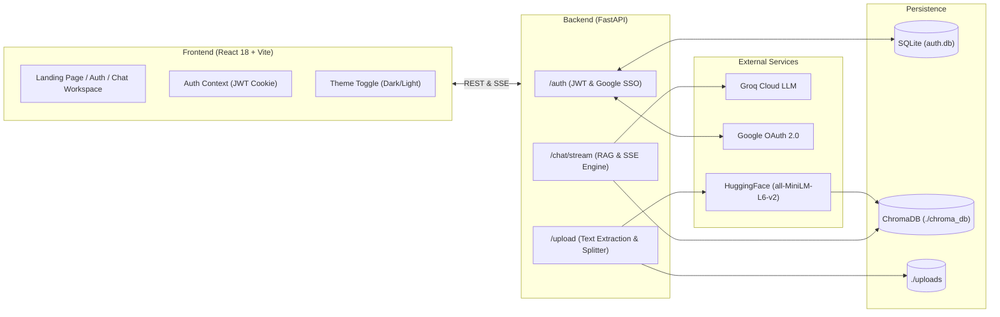

# 🚀 DocChat AI — RAG Document Intelligence Platform

[](https://www.python.org/downloads/)
[](https://fastapi.tiangolo.com)
[](https://react.dev)
[](https://vitejs.dev)
[](https://www.trychroma.com)
[](https://groq.com)

**DocChat AI** is a full-stack, retrieval-augmented generation (RAG) web application that empowers users to upload documents (`PDF`, `DOCX`, `TXT`), query them in natural language, and receive grounded answers backed by precise, verifiable page-level source citations.

---

## 📑 Full Documentation Reference

> 📖 **Looking for in-depth architecture diagrams, citation math, and internal subsystem specifications?**  
> Check out the complete reference: [**`DOCUMENTATION.md`**](./DOCUMENTATION.md)

---

## ✨ Features at a Glance

- 📄 **Multi-Format Ingestion:** Drag-and-drop support for PDF, DOCX, and TXT documents.
- 🎯 **Zero-Hallucination Grounding:** Multi-stage citation engine filters ungrounded claims, negative answers, and low-confidence chunks.
- ⚡ **Real-Time Token Streaming:** Server-Sent Events (SSE) stream responses instantly.
- 🧠 **Free Local Embeddings:** `sentence-transformers/all-MiniLM-L6-v2` runs locally on your CPU (zero embedding API costs).
- ⚡ **Ultra-Fast LLM Inference:** Powered by Groq's high-speed inference engine (`openai/gpt-oss-120b` or `llama-3.3-70b-versatile`).
- 🔐 **Dual Authentication:** Secure email/password authentication (bcrypt + HTTP-only JWT cookies) + Google OAuth 2.0 (Google Identity Services One-Tap & server-side redirect).
- 🌓 **Dark & Light Mode:** Fluid design system with custom CSS variables, glassmorphism, and responsive layout.
- 💬 **Conversational Memory:** Contextual multi-turn dialogue with prompt suggestions and markdown formatting.

---

## 🏗️ System Architecture



---

## 📁 Repository Structure

```
RAG/
├── backend/
│   ├── main.py                        # FastAPI entry point & lifespan initialization
│   ├── requirements.txt               # Python package dependencies
│   ├── .env.example                   # Backend environment template
│   ├── auth.db                        # SQLite database for user accounts
│   ├── chroma_db/                     # Persistent ChromaDB vector index
│   ├── uploads/                       # Document storage directory
│   ├── auth/                          # Authentication Subsystem
│   │   ├── database.py                # Async SQLite connection pool
│   │   ├── dependencies.py            # FastAPI auth guards & cookie extraction
│   │   ├── models.py                  # Pydantic auth schemas
│   │   ├── router.py                  # Signup, Signin, Google OAuth endpoints
│   │   └── utils.py                   # Bcrypt hashing & PyJWT token utilities
│   ├── config/
│   │   └── settings.py                # Pydantic Settings (.env configuration)
│   ├── models/
│   │   └── schemas.py                 # Request/Response schemas (Upload, Docs, Chat)
│   ├── routes/
│   │   ├── chat.py                    # POST /chat and POST /chat/stream (SSE)
│   │   ├── documents.py               # GET /documents, DELETE /documents/{id}
│   │   └── upload.py                  # POST /upload multi-file ingestion
│   └── services/
│       ├── chat_service.py            # RAG prompt generation, memory, & Groq client
│       ├── citation_service.py        # Precision citation filtering & alignment
│       ├── deps.py                    # Singleton dependency providers
│       ├── document_metadata.py       # Document status & metadata JSON registry
│       ├── document_processor.py      # Extract → Chunk → VectorStore orchestrator
│       ├── embedding_service.py       # HuggingFace all-MiniLM-L6-v2 singleton
│       ├── text_chunker.py            # RecursiveCharacterTextSplitter wrapper
│       ├── text_extractor.py          # PyPDFLoader, Docx2txtLoader, TextLoader
│       └── vector_store.py            # ChromaDB interface
├── frontend/
│   ├── index.html                     # HTML5 entrypoint
│   ├── vite.config.js                 # Vite bundler configuration
│   ├── package.json                   # NPM dependencies & scripts
│   ├── .env                           # Frontend environment configuration
│   └── src/
│       ├── main.jsx                   # React root mount
│       ├── App.jsx                    # Route switch & provider tree
│       ├── index.css                  # Global tokens, themes, & utility classes
│       ├── api/
│       │   └── client.js              # Fetch client with credentials: 'include'
│       ├── contexts/
│       │   ├── AuthContext.jsx        # Auth state, session check, & sign-in methods
│       │   └── ThemeContext.jsx       # Dark/Light mode theme state
│       ├── pages/
│       │   ├── LandingPage.jsx        # Product landing page with live interactive demo
│       │   ├── LoginPage.jsx          # Login form + Google SSO
│       │   ├── SignupPage.jsx         # Registration form + Google SSO
│       │   └── ChatApp.jsx            # Main protected chat workspace
│       └── components/
│           ├── ProtectedRoute.jsx     # Route authentication guard
│           ├── Sidebar.jsx            # Document list, storage stats, user card
│           ├── FileUpload.jsx         # Drag-and-drop file upload zone
│           ├── ChatPanel.jsx          # Conversation feed & prompt input
│           ├── MessageBubble.jsx      # Markdown message display & copy buttons
│           ├── SourceCitations.jsx    # Grounded citation cards with excerpts
│           ├── GoogleSignInButton.jsx # Google One-Tap & OAuth redirect button
│           ├── MarkdownRenderer.jsx   # Syntax-highlighted code & tables
│           └── ThemeToggle.jsx        # Sun/moon dark mode toggle
├── DOCUMENTATION.md                   # Full system design and architecture reference
└── README.md                          # Quick start guide
```

---

## ⚡ Quick Start

### 1. Prerequisites

- **Python 3.10+**
- **Node.js 18+** & npm
- **Groq API Key:** Free account at [console.groq.com](https://console.groq.com)

---

### 2. Backend Setup

```bash
cd backend

# 1. Create and activate virtual environment
python -m venv venv

# Windows:
.\venv\Scripts\Activate.ps1
# macOS / Linux:
# source venv/bin/activate

# 2. Install dependencies
pip install -r requirements.txt

# 3. Configure environment
copy .env.example .env

# Edit .env and enter your Groq API Key:
# GROQ_API_KEY=gsk_your_key_here

# 4. Start the backend server
python -m uvicorn main:app --host 127.0.0.1 --port 8000
```

> **First Run Note:** On initial boot, the backend automatically downloads the `all-MiniLM-L6-v2` embedding model (~90 MB) into `~/.cache/huggingface`. Please allow 30–60 seconds for completion. Subsequent boots take under 1 second.

The API runs at **`http://localhost:8000`**.  
Interactive Swagger docs: **`http://localhost:8000/docs`**.

---

### 3. Frontend Setup

In a separate terminal:

```bash
cd frontend

# 1. Install Node dependencies
npm install

# 2. Start Vite development server
npm run dev
```

Open **`http://localhost:5173`** in your browser.

---

## 🔑 Google OAuth Setup (Optional)

To enable "Continue with Google" sign-in:

1. Open [Google Cloud Console > Credentials](https://console.cloud.google.com/apis/credentials).
2. Create an **OAuth 2.0 Client ID** (Application type: *Web application*).
3. Add **Authorized JavaScript origins**:
   - `http://localhost:5173`
   - `http://localhost`
   - `http://127.0.0.1:5173`
4. Add **Authorized redirect URIs**:
   - `http://localhost:8000/auth/google/callback`
5. Copy your Client ID and Client Secret into `backend/.env`:
   ```ini
   GOOGLE_CLIENT_ID=your-client-id.apps.googleusercontent.com
   GOOGLE_CLIENT_SECRET=GOCSPX-your-secret
   ```
6. Copy the Client ID into `frontend/.env`:
   ```ini
   VITE_GOOGLE_CLIENT_ID=your-client-id.apps.googleusercontent.com
   ```

---

## ⚙️ Environment Variables Summary

### Backend (`backend/.env`)
| Variable | Required | Default | Purpose |
| :--- | :---: | :--- | :--- |
| `GROQ_API_KEY` | **Yes** | — | LLM inference via Groq |
| `GROQ_MODEL` | No | `openai/gpt-oss-120b` | Groq model selection |
| `EMBEDDING_MODEL`| No | `all-MiniLM-L6-v2` | Local HuggingFace embeddings |
| `CHROMA_PERSIST_DIR` | No | `./chroma_db` | ChromaDB vector store directory |
| `CHUNK_SIZE` | No | `800` | Target chunk character length |
| `CHUNK_OVERLAP` | No | `200` | Overlap characters between chunks |
| `RETRIEVAL_TOP_K` | No | `6` | Number of candidate chunks retrieved |
| `SIMILARITY_THRESHOLD` | No | `0.20` | Cutoff similarity threshold for citations |
| `JWT_SECRET_KEY` | **Yes** | *[secret]* | Key used to sign JWT auth cookies |
| `GOOGLE_CLIENT_ID`| No | — | Google OAuth Client ID |
| `GOOGLE_CLIENT_SECRET`| No | — | Google OAuth Client Secret |

### Frontend (`frontend/.env`)
| Variable | Required | Default | Purpose |
| :--- | :---: | :--- | :--- |
| `VITE_GOOGLE_CLIENT_ID` | No | — | Public Google Client ID for GIS button |

---

## 🧪 Testing

Run the automated test suite from `backend/`:

```powershell
# Google OAuth & GIS Redirect Test
python test_google_auth.py

# User Registration & Auth Cookie Lifecycle
python test_auth_integration.py

# Precision Citation & Margin Filtering Test
python test_citation_filter.py

# End-to-End System Test
python test_e2e.py
```

---

## 📜 License

Distributed under the MIT License. See `LICENSE` for more information.
